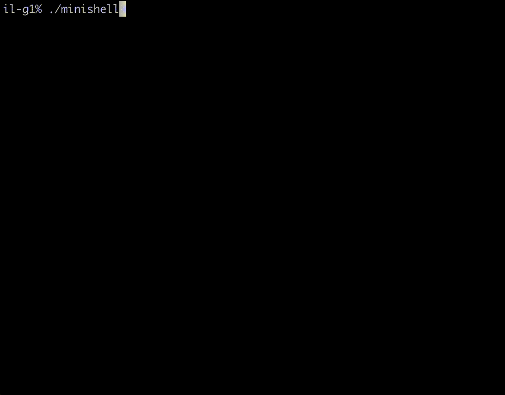

# bash
The main goal of this project is to understand essence of Bash execution routines.
As is, this project consists of interpreter (lexer and parser) and ececutor.
This bash variation:

	• Have a working History.

	• Launces the right executable (based on the PATH variable or by using relative or absolute path)

	• Handles redirects (< , <<, >, >>) without any FD redirections
  	(thus, 2> file wont redirect STDERR to a given file FD)
	
	
	• Handles pipe and chains of pipe accordinglye (ls | grep . | wc, ls > file | wc, etc)

	• Handles it's own "global" and local variables, $0 and $? commands

	• Handles SIGINT, SIGQUIT and EOF signals accordingly, simulating original bash behaviour

Also, encountering ’ inhibits all interpretation of a sequence of characters,
encountering  " inhibits all interpretation of a sequence of characters except for $.
 
This implementation has it's own built-in functions, such as 
  	◦ echo with option -n
	
  	◦ cd with only a relative or absolute path
	
  	◦ pwd with no options
	
  	◦ export with no options
	
  	◦ unset with no options
	
  	◦ env with no options or arguments
	
 	 ◦ exit with no options

